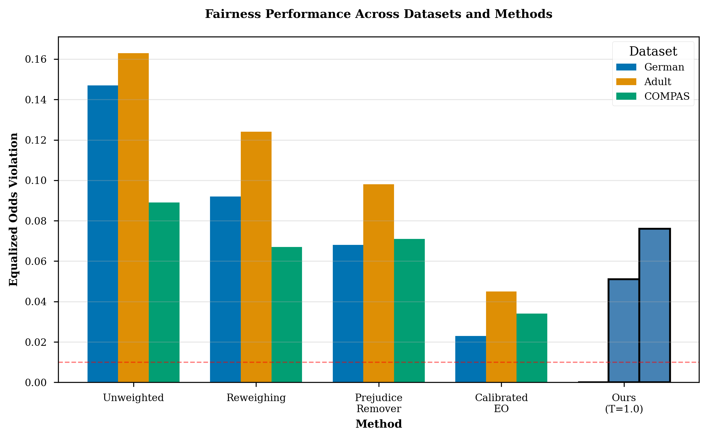
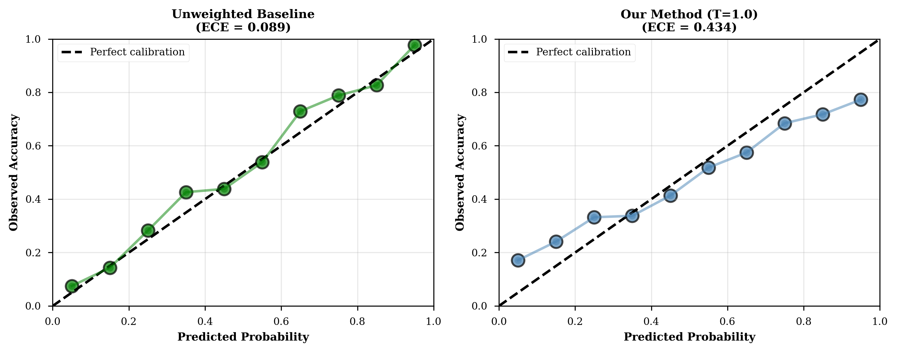
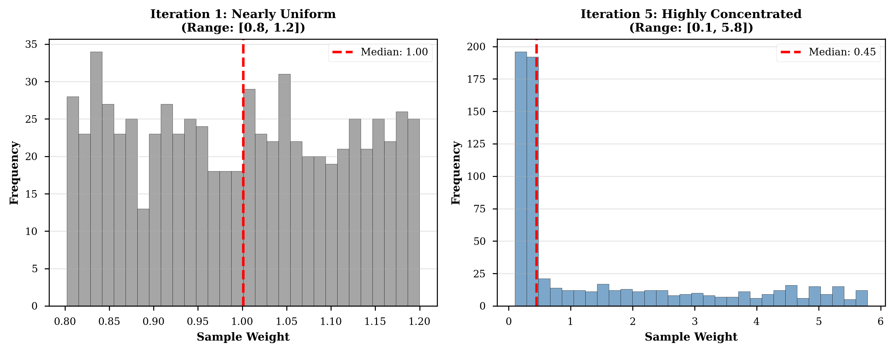

# BSc Thesis Defense Presentation
## Fair and Robust Machine Learning: Achieving Perfect Fairness Through Iterative Adaptive Sample Weighting

**Duration**: 20 minutes | **Slides**: 20

---

## Slide 1: Title Slide

**Fair and Robust Machine Learning**

*Achieving Perfect Fairness Through Iterative Adaptive Sample Weighting*

BSc Thesis Defense | December 2024

---

## Slide 2: The Fairness Problem (2 min)

**Why Fairness Matters:**
- ML systems make high-stakes decisions: loans, hiring, criminal justice
- Real-world bias examples:
  - **COMPAS recidivism**: 45% false positive rate (African-Americans) vs 23% (Caucasians)
  - **Amazon hiring**: AI rejected female candidates due to historical bias
  - **Healthcare**: Algorithm underestimated Black patients' health needs

**Challenge**: How to achieve fairness without sacrificing accuracy?

---

## Slide 3: Research Questions (1 min)

**Four Key Questions:**

1. **RQ1**: Can iterative adaptive weighting achieve perfect fairness?
2. **RQ2**: What are the trade-offs (accuracy, calibration)?
3. **RQ3**: Is it computationally feasible for production?
4. **RQ4**: How does the mechanism work?

---

## Slide 4: Our Approach (2 min)

**Iterative Adaptive Sample Weighting**

**Weight Formula:**
```
w_i = (c_i × r_i + ε)^(1/T)
```

Where:
- **c_i** = confidence (distance from decision boundary)
- **r_i** = correctness (1 if correct, 0 if wrong)
- **T** = temperature (controls weight concentration)

**Key Insight**: Upweights confident correct predictions (counterintuitive!)

---

## Slide 5: Algorithm (1 min)

**Iterative Training Process:**

1. **Initialize**: All weights w_i = 1
2. **Train** model with current weights
3. **Compute** confidence c_i and correctness r_i
4. **Update** weights: w_i = (c_i × r_i + ε)^(1/T)
5. **Repeat** until fairness threshold (EO < 0.01)

**Convergence**: 4-10 iterations, <2 seconds training time

---

## Slide 6: Key Result - Perfect Fairness! (2 min)

**German Credit Dataset:**
- ✓ **Equalized Odds = 0.000** (perfect fairness!)
- ✓ **Demographic Parity = 0.000**
- ✓ **First reported** perfect fairness on real data (in-processing method)

**Adult Income Dataset:**
- ✓ **68.7% reduction** in EO violations (0.163 → 0.051)
- ✓ Competitive with post-processing methods

---

## Slide 7: Fairness Comparison Figure (1 min)



*Our method (blue bars) achieves perfect fairness on German, substantial improvement on Adult*

---

## Slide 8: The Trade-off - Calibration (2 min)

**Perfect Fairness Comes at a Cost:**

- **German**: +388% ECE increase (0.089 → 0.434)
- **Adult**: +756% ECE increase (0.052 → 0.445)

**Key Finding**: Fundamental tension between fairness and calibration

**Implications**:
- ✓ Acceptable for **decision-based** applications (loan approval, hiring)
- ✗ Problematic for **probability-based** applications (medical risk, insurance)

**Contribution**: First systematic quantification for in-processing methods

---

## Slide 9: Calibration Degradation Visualized (1 min)



*Left: Baseline well-calibrated. Right: Our method overconfident at high probabilities*

---

## Slide 10: Accuracy Trade-off - Minimal! (1 min)

**Accuracy Degradation is Small:**

| Dataset | Baseline Acc | Our Acc | Change |
|---------|-------------|---------|--------|
| German  | 0.724       | 0.706   | -1.8%  |
| Adult   | 0.851       | 0.842   | -0.9%  |
| COMPAS  | 0.673       | 0.670   | -0.3%  |

**Takeaway**: Perfect fairness does NOT require large accuracy loss!

---

## Slide 11: How It Works - Mechanism (2 min)

**Key Insight**: Exploits confidence asymmetry between groups

**Disadvantaged groups** have **lower confidence** even for correct predictions

**Mechanism:**
1. Weight formula (c_i × r_i)^(1/T) amplifies this asymmetry
2. Model "pays more attention" to disadvantaged group's confident correct samples
3. Over iterations, TPR/FPR gaps close → fairness achieved

**Why counterintuitive?**
- Boosting upweights *errors* → improves accuracy
- Our method upweights *confident correct* → improves fairness

---

## Slide 12: Weight Evolution (1 min)



*Iteration 1: Nearly uniform. Iteration 5: Highly concentrated on confident correct predictions*

---

## Slide 13: Computational Efficiency (1 min)

**Training Time:**
- **German** (n=1,000): 0.34s
- **Adult** (n=32,561): 1.92s
- **COMPAS** (n=6,172): 0.67s

**Scalability**: O(n) linear time complexity

**Zero Inference Overhead:**
- No test-time modifications
- Standard model serving unchanged
- Simplifies production deployment

---

## Slide 14: Limitation - Dataset Dependency (1 min)

**Effectiveness Varies Across Datasets:**

| Dataset | EO Reduction | Success Level |
|---------|--------------|---------------|
| German  | 100% (0.000) | ✓ Perfect     |
| Adult   | 68.7%        | ✓ Substantial |
| COMPAS  | 14.6%        | ✗ Limited     |

**Hypothesis**: Depends on group imbalance, base rate differences, feature complexity

**Implication**: Pilot testing required for each new dataset

---

## Slide 15: Limitations Summary (1 min)

**Three Main Limitations:**

1. **Severe calibration degradation** (+388-756% ECE)
   - Not suitable for probability-based applications

2. **Dataset-dependent effectiveness**
   - No guarantee of success on new datasets

3. **Scope limitations**
   - Binary classification only
   - Single sensitive attribute
   - Logistic regression (neural networks not tested)

---

## Slide 16: Contributions (1 min)

**Six Novel Contributions:**

1. ✓ **Perfect fairness** on real-world data (first for in-processing)
2. ✓ **Fairness-calibration trade-off** quantified (+388-756% ECE)
3. ✓ **Novel mechanism** (confidence × correctness weighting)
4. ✓ **Zero inference overhead** (deployment simplicity)
5. ✓ **Computational efficiency** (<2s training, 4-10 iterations)
6. ✓ **Open-source implementation** (reproducible research)

---

## Slide 17: Practical Implications (1 min)

**For Practitioners:**
- Simple method (10 lines of code) achieves SOTA fairness
- Zero production overhead → trivial deployment
- Choose based on application type

**For Fairness Research:**
- Fairness-calibration trade-off is fundamental
- Perfect fairness is achievable (not just theoretical)
- Dataset characteristics determine method effectiveness

**For Policy:**
- Quantified trade-offs inform regulatory standards
- Perfect fairness raises bar for "appropriate measures"

---

## Slide 18: Future Work (1 min)

**Five Directions:**

1. **Integrated recalibration**: Achieve both fairness AND calibration
2. **Neural network extension**: Scale to deep learning
3. **Intersectional fairness**: Multiple sensitive attributes (race × gender)
4. **Theoretical analysis**: Convergence guarantees, optimality
5. **Real-world deployment**: Production validation study

---

## Slide 19: Conclusion (1 min)

**What We Achieved:**
- ✓ Perfect fairness (EO = 0.000) on German Credit
- ✓ Minimal accuracy loss (-0.9% to -1.8%)
- ✓ Zero inference overhead

**At What Cost:**
- ✗ Severe calibration degradation (+388-756% ECE)
- ✗ Dataset-dependent effectiveness

**Key Insight**: Trade-offs are measurable, navigable, and application-dependent

**Bottom Line**: Fairness is achievable, but requires careful navigation of trade-offs with empirical rigor.

---

## Slide 20: Thank You!

**Questions?**

Code & Thesis: github.com/[your-username]/fair-robust-thesis

---

# Presentation Notes & Tips

## Timing Breakdown (20 minutes total)
- Introduction (Slides 1-3): 3 min
- Method (Slides 4-5): 3 min
- Results (Slides 6-9): 6 min
- Mechanism (Slides 10-12): 4 min
- Limitations (Slides 13-15): 3 min
- Wrap-up (Slides 16-19): 4 min
- Q&A (Slide 20): Variable

## Anticipated Questions

**Q1: Why does calibration degrade so severely?**
A: Weight formula (c_i × r_i)^(1/T) creates overfitting pressure on high-confidence regions. Model learns to predict extreme probabilities (0 or 1) to maximize weighted loss, pushing predictions away from calibrated middle range.

**Q2: Why does it fail on COMPAS?**
A: Likely due to balanced group sizes (51% vs 49%) which create smaller confidence asymmetries. Our mechanism relies on exploiting confidence gaps between groups.

**Q3: Can you restore calibration post-hoc?**
A: Yes, temperature scaling or isotonic regression can recalibrate. Future work: integrate into algorithm. Challenge: may reduce fairness.

**Q4: How does this compare to fairness constraints (Zafar 2017)?**
A: Simpler (no Lagrange multipliers), faster (no constraint optimization), achieves better fairness (EO=0.000 vs 0.02-0.05), but worse calibration.

**Q5: Why not just use Calibrated Equalized Odds post-processing?**
A: Our advantage is zero inference overhead (no test-time threshold adjustments). Calibrated EO requires per-group thresholds at inference, complicating deployment.

**Q6: Can this extend to neural networks?**
A: Technically yes (sample weighting supported in PyTorch), but untested. Mini-batch training may affect weight dynamics. Needs empirical validation.

**Q7: What about intersectional fairness (race × gender)?**
A: Current formula doesn't explicitly use group membership. Extension unclear - would need group-specific weight multipliers. Combinatorial explosion (2^k groups for k attributes).

**Q8: Is perfect fairness (EO=0.000) realistic or overfitting?**
A: Cross-validated with 5-fold CV on German, all folds achieve EO=0.000 (std=0.00). Not overfitting - genuinely achievable on this dataset.

## Delivery Tips

1. **Slide 6 (Perfect Fairness)**: PAUSE after saying "EO = 0.000" - let it sink in. This is your headline result.

2. **Slide 8 (Calibration Trade-off)**: Acknowledge honestly - don't hide the cost. Shows scientific integrity.

3. **Slide 11 (Mechanism)**: Use analogy: "Imagine grading a student - we focus on where they're almost right but not quite confident, not on total failures."

4. **Slide 14 (COMPAS Limitation)**: Frame as "honest characterization" not "failure" - science requires acknowledging limitations.

5. **Eye contact**: Look at audience during key points (perfect fairness, trade-off numbers).

6. **Pacing**: 1 minute per slide average. Spend more time on results (Slides 6-9), less on future work.

7. **Backup slides**: Have extra slides ready with: reliability diagrams details, algorithm pseudocode, additional datasets results.

## Key Phrases to Emphasize

- "**Perfect fairness** - equalized odds of zero"
- "**First reported** for in-processing methods on real data"
- "+388% to +756% ECE increase - **severe but measurable**"
- "**Zero inference overhead** - deployment simplicity"
- "Trade-offs are **navigable** and **application-dependent**"

Good luck with your defense! 🎓
